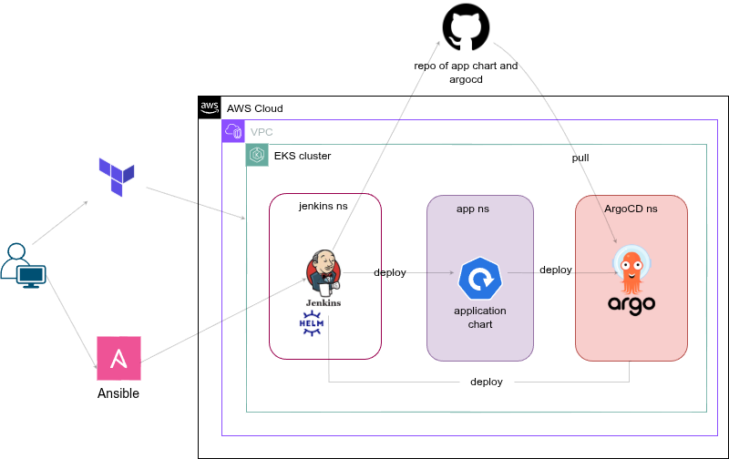

# 📦 EKS CI/CD Pipeline with Terraform, Ansible, and Jenkins

 

## 🧩 Overview

This project demonstrates a complete **CI/CD pipeline deployed on AWS EKS**, orchestrated using:
- **Terraform**: to provision an EKS cluster on AWS
- **Ansible**: to deploy Jenkins with (SA,role,rolebinding) to the EKS cluster in jenkins namespace
- **Jenkins**: to deploy an application Helm chart onto the same EKS cluster in app name space

The workflow enables automated infrastructure provisioning, configuration management, and application deployment—all containerized and managed within a Kubernetes environment.

---

## 🔧 Tools & Technologies

| Tool      | Purpose                                    |
|-----------|--------------------------------------------|
| Terraform | Provision EKS cluster and networking setup |
| docker    | create custom jenkins image                |
| Ansible   | Automate Jenkins deployment on EKS         |
| Jenkins   | Deploy app Helm chart onto the EKS cluster |
| Helm      | used by jenkins to deploy app chart        |
| ArgoCD (optional) | GitOps-style continuous delivery   |

---

## 🚀 Workflow Summary

1. **Provision Infrastructure (Terraform)**
   - Creates VPC, IAM roles, and EKS cluster in AWS

2. **Deploy Jenkins (Ansible)**
   - Jenkins is deployed in a dedicated namespace (`jenkins ns`)
   - Configured to run in the EKS cluster

3. **Deploy Application (tradebyte-app)**
   - Jenkins uses Helm to deploy an application chart into the `app ns`
   - ArgoCD (in `ArgoCD ns`) optionally pulls application updates from GitHub

---

## ⚙️ Getting Started

> Make sure you have AWS CLI, Terraform, Ansible, and `kubectl` installed.

### 1. Clone the repository

``` bash
git clone https://github.com/AHMEDMOSSAD29/DevOps--projects.git
cd DevOps--projects/EKS-CICD-APP/
```

### 2. Provision EKS using Terraform
``` bash
cd terraform
terraform init
terraform apply -var-file prod.tfvars
```

### 3. Deploy Jenkins with Ansible
``` bash
cd ../ansible
ansible-playbook playbook.yaml
```

### 4. Trigger CI/CD pipeline via Jenkins
- Access the Jenkins UI
- Run the pipeline job that deploys the app using Helm
- Jenkins script  ../jenkins/[Jenkinsfile](jenkins/Jenkinsfile)
  
### 5. if deployed in minikube
- use this command to access jenkins and tradebyte-app
``` bash
minikube service -n jenkins jenkins-service
minikube service -n app tradebyte-service
```
---

### diagram

